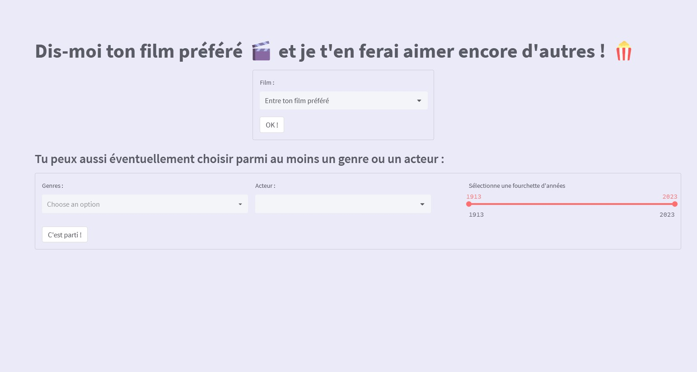

- Application de recommandation de films, basée sur le Machine Learning

- Projet réalisé en collaboration avec [Camille Magnette](https://www.linkedin.com/in/camille-magnette-4305b057/) et [Marie Lefebvre](https://www.linkedin.com/in/marie-lefebvre-50654a269/)

- Source base de données : [IMDb](https://datasets.imdbws.com/)

- Outils : :snake:Python (pandas, scikit-learn), streamlit 
- Lien vers l'application finale : [Appli cinemat](https://cinemat.streamlit.app/)  
<a href="https://cinemat.streamlit.app/" target="_blank">

